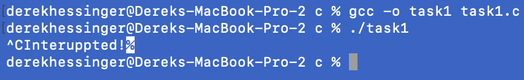
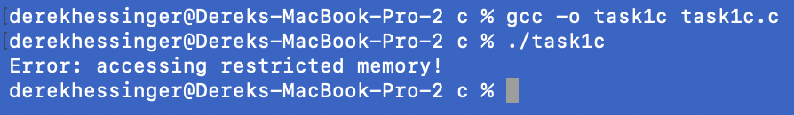
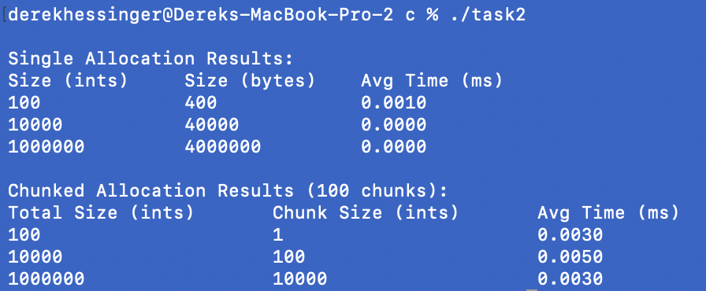
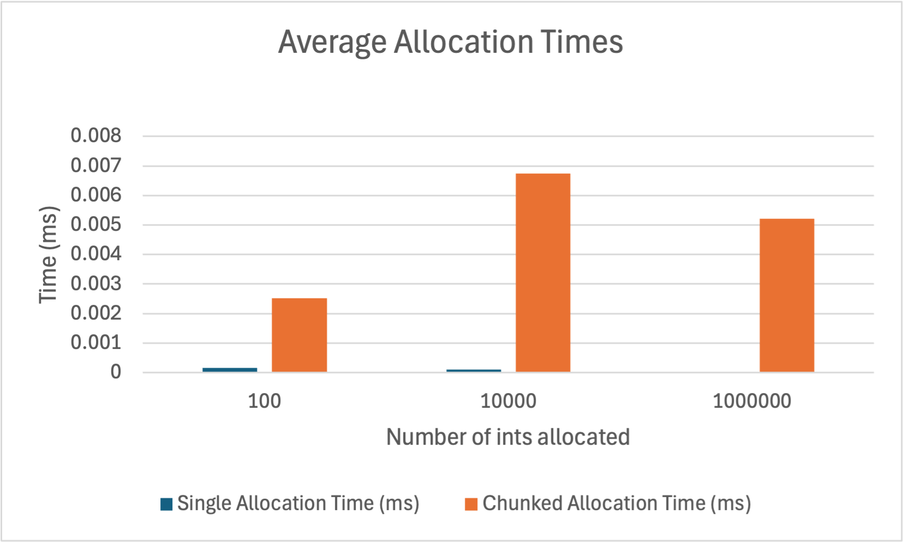
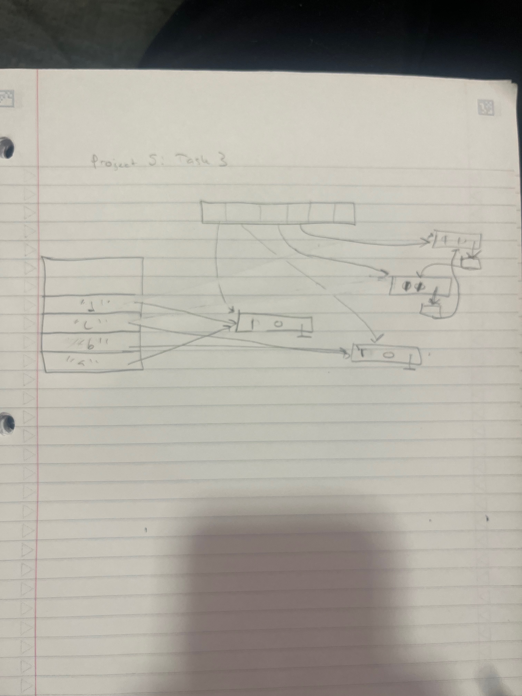
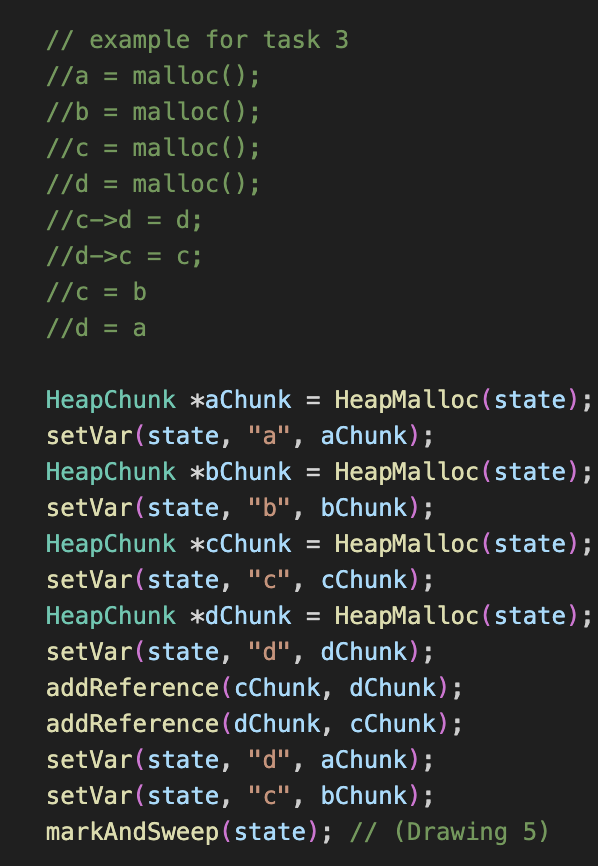
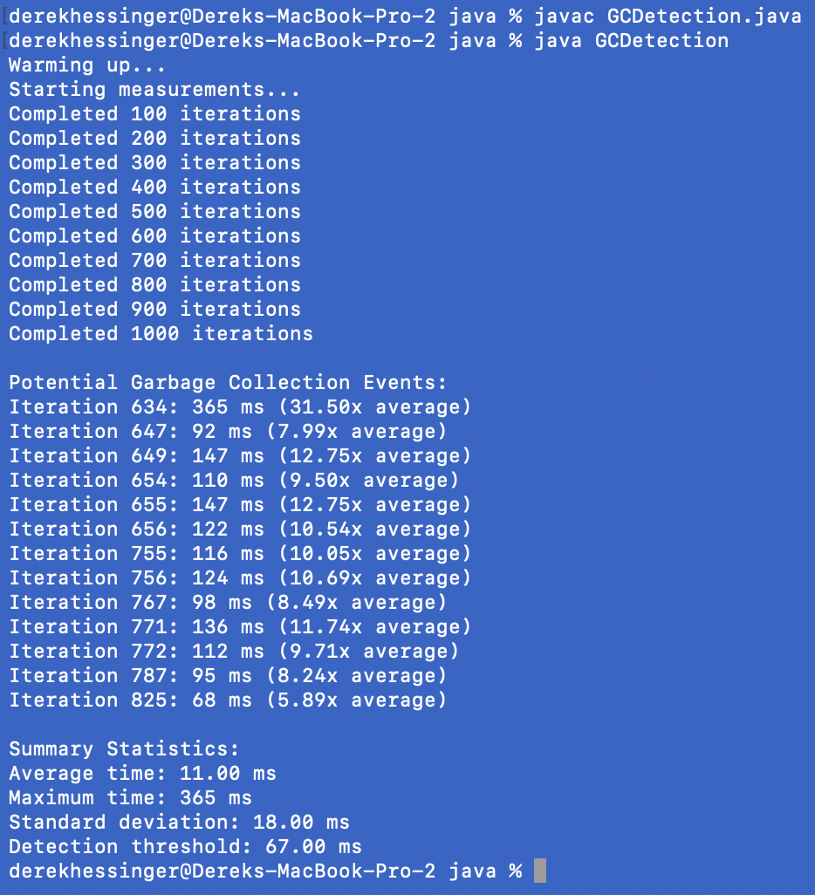

# Project 5
Derek Hessinger (partner Sumira Naroola)   
Prof. Ying Li   
CS 333   
11/20/24

## Google Sites URL: https://sites.google.com/d/1z3ifMCKviLv4hrWD1Vpz557ezQE72CFp/p/1H0R9PBBWUxnczyq0PqA267kSccjo3oW3/edit

## Directory Tree

## Operating system and C Compiler
OS: Apple Sonoma \
C compiler: Apple clang version 15.0.0 (clang-1500.3.9.4), Target: arm64-apple-darwin23.5.0, Thread model: posix

## Part 1

### Task 1a
To compile and run the program:  
```
gcc -o task1 task1.c  
./task1
```
There are no known bugs within the program.  
Output of the program:  


### Task 1b
To compile and run the program:  
```
gcc -o task1b task1b.c  
./task1b
```
There are no known bugs within the program.  
Output of the program:  


### Task 1c
To compile and run the program:  
```
gcc -o task1c task1c.c  
./task1c
```
There are no known bugs within the program.  
Output of the program:  


### Task 2
To compile and run the program:  
```
gcc -o task2 task2.c  
./task2
```
There are no known bugs within the program.  
Output of the program:  



What is seen in the experiment is that the trends relating allocation time to the size of the allocation is for single allocation, the time it takes to allocate space for each integer becomes more efficient when a larger number is needed. It is also clear that single allocation works much faster than chunked allocation when comparing the times as seen in the image above.

### Task 3
To compile and run the program:  
```
gcc -o garbage_detector garbage_detector.c  
./garbage_detector
```
There are no known bugs within the program.  
Drawing of the program:  



## Part 2
### Tasks 1 and 2 -> google sites link: https://sites.google.com/d/1z3ifMCKviLv4hrWD1Vpz557ezQE72CFp/p/1H0R9PBBWUxnczyq0PqA267kSccjo3oW3/edit

### Task 3
To compile and run the program:  
```
javac GCDetection.java
java GCDetection  
```
There are no known bugs within the program.  
Output of the program:


As seen in the output above, by trying many iterations of creating a bunch of objects and timing how long it takes for each iteration, we can determine when garbage collections occur. We did this by calculating the standard deviation of the total amount of times, and selecting those well without the range (3x) to be considered garbage collection periods. 

## Extensions
For our extensions, we completed the memory management task in OCaml, which can be found on the google sites.